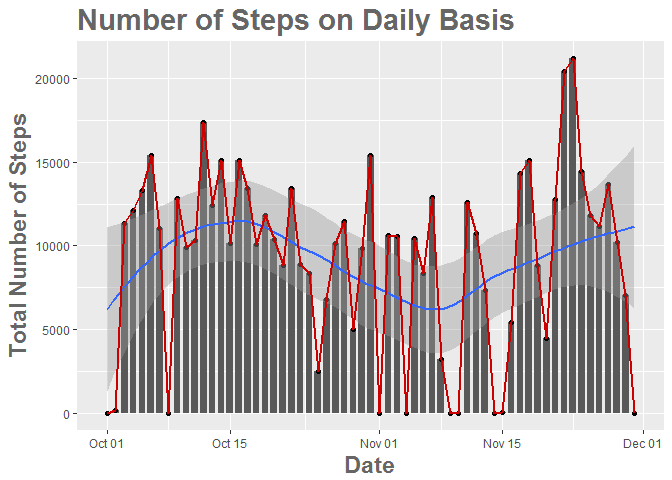
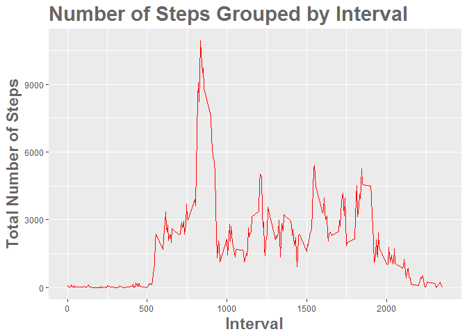
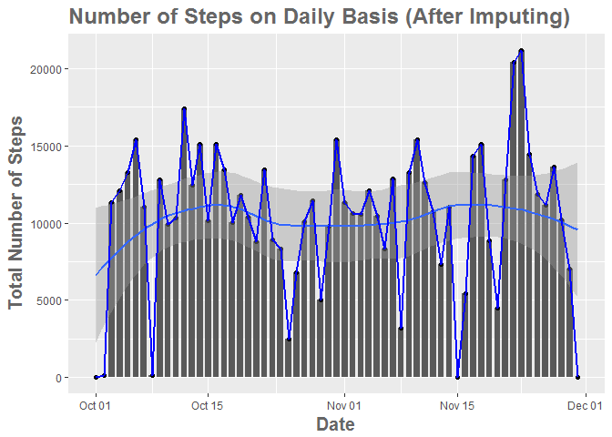
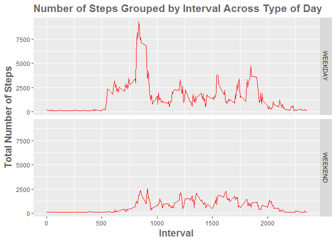

# Reproducible Research: Peer Assessment 1


## Loading and preprocessing the data

```r
  data <- read.csv("activity.csv", na.strings = "NA")
  data$date <- as.Date(data$date)
  head(data)
```

```
##   steps       date interval
## 1    NA 2012-10-01        0
## 2    NA 2012-10-01        5
## 3    NA 2012-10-01       10
## 4    NA 2012-10-01       15
## 5    NA 2012-10-01       20
## 6    NA 2012-10-01       25
```
## What is mean total number of steps taken per day?

```r
  ### USE data.table AND ggplot2 PACKAGES
    library(data.table)
    library(ggplot2)
```

```r
  ### AGGREGATE THE TOTAL STEPS GROUPED BY DATE
	  data <- data.table(data)
  	data[, total_steps:=sum(steps, na.rm=TRUE), by=date]
  	aggregate <- unique(data[,c('date','total_steps')])
```

```r
  ### VIEW SAMPLE DATA
    head(aggregate)
```

```
##          date total_steps
## 1: 2012-10-01           0
## 2: 2012-10-02         126
## 3: 2012-10-03       11352
## 4: 2012-10-04       12116
## 5: 2012-10-05       13294
## 6: 2012-10-06       15420
```

```r
  ### DRAW A BARPLOT
    plot <- ggplot(data = aggregate, aes(x=date, y=total_steps)) 
    plot <- plot + xlab("Date") + ylab("Total Number of Steps") + ggtitle("Number of Steps on Daily Basis") 
    plot <- plot + geom_bar(stat='identity', width=0.75, position=position_dodge(0.7)) + geom_point()
    plot <- plot + geom_smooth() + geom_line(lwd=1, col = "red3",cex=0.5)
  ### ADD THEME
    plot <- plot + theme(plot.title = element_text(color="#666666", face="bold", size=22)) 
    plot <- plot + theme(axis.title = element_text(color="#666666", face="bold", size=17))     
```

```
## `geom_smooth()` using method = 'loess'
```

<!-- -->

```r
  ### COPY PLOT TO PLOT1.PNG
    with(plot,dev.copy(png, 'plot1.png'))
  ### CLOSE THE GRAPHICS DEVICE
    dev.off()
```

```r
  ### CALCULATE MEAN AND MEDIAN OF THE TOTAL NUMBER OF STEPS TAKEN EACH DAY
    data[, mean:=mean(steps, na.rm = TRUE), by=date]
    data[, median:=as.numeric(median(steps, na.rm = TRUE)), by=date]
```

```r
  ### TAKE UNIQUE FOR DATE, TOTAL_STEPS, MEAN AND MEDIAN
    summary <- unique(data[,c('date','total_steps','mean','median')])
    summary
```

```
##           date total_steps       mean median
##  1: 2012-10-01           0        NaN     NA
##  2: 2012-10-02         126  0.4375000      0
##  3: 2012-10-03       11352 39.4166667      0
##  4: 2012-10-04       12116 42.0694444      0
##  5: 2012-10-05       13294 46.1597222      0
##  6: 2012-10-06       15420 53.5416667      0
##  7: 2012-10-07       11015 38.2465278      0
##  8: 2012-10-08           0        NaN     NA
##  9: 2012-10-09       12811 44.4826389      0
## 10: 2012-10-10        9900 34.3750000      0
## 11: 2012-10-11       10304 35.7777778      0
## 12: 2012-10-12       17382 60.3541667      0
## 13: 2012-10-13       12426 43.1458333      0
## 14: 2012-10-14       15098 52.4236111      0
## 15: 2012-10-15       10139 35.2048611      0
## 16: 2012-10-16       15084 52.3750000      0
## 17: 2012-10-17       13452 46.7083333      0
## 18: 2012-10-18       10056 34.9166667      0
## 19: 2012-10-19       11829 41.0729167      0
## 20: 2012-10-20       10395 36.0937500      0
## 21: 2012-10-21        8821 30.6284722      0
## 22: 2012-10-22       13460 46.7361111      0
## 23: 2012-10-23        8918 30.9652778      0
## 24: 2012-10-24        8355 29.0104167      0
## 25: 2012-10-25        2492  8.6527778      0
## 26: 2012-10-26        6778 23.5347222      0
## 27: 2012-10-27       10119 35.1354167      0
## 28: 2012-10-28       11458 39.7847222      0
## 29: 2012-10-29        5018 17.4236111      0
## 30: 2012-10-30        9819 34.0937500      0
## 31: 2012-10-31       15414 53.5208333      0
## 32: 2012-11-01           0        NaN     NA
## 33: 2012-11-02       10600 36.8055556      0
## 34: 2012-11-03       10571 36.7048611      0
## 35: 2012-11-04           0        NaN     NA
## 36: 2012-11-05       10439 36.2465278      0
## 37: 2012-11-06        8334 28.9375000      0
## 38: 2012-11-07       12883 44.7326389      0
## 39: 2012-11-08        3219 11.1770833      0
## 40: 2012-11-09           0        NaN     NA
## 41: 2012-11-10           0        NaN     NA
## 42: 2012-11-11       12608 43.7777778      0
## 43: 2012-11-12       10765 37.3784722      0
## 44: 2012-11-13        7336 25.4722222      0
## 45: 2012-11-14           0        NaN     NA
## 46: 2012-11-15          41  0.1423611      0
## 47: 2012-11-16        5441 18.8923611      0
## 48: 2012-11-17       14339 49.7881944      0
## 49: 2012-11-18       15110 52.4652778      0
## 50: 2012-11-19        8841 30.6979167      0
## 51: 2012-11-20        4472 15.5277778      0
## 52: 2012-11-21       12787 44.3993056      0
## 53: 2012-11-22       20427 70.9270833      0
## 54: 2012-11-23       21194 73.5902778      0
## 55: 2012-11-24       14478 50.2708333      0
## 56: 2012-11-25       11834 41.0902778      0
## 57: 2012-11-26       11162 38.7569444      0
## 58: 2012-11-27       13646 47.3819444      0
## 59: 2012-11-28       10183 35.3576389      0
## 60: 2012-11-29        7047 24.4687500      0
## 61: 2012-11-30           0        NaN     NA
##           date total_steps       mean median
```
## What is the average daily activity pattern?

```r
  ### AGGREGATE THE TOTAL STEPS GROUPED BY INTERVAL
    data <- data.table(data)
  	data[, total_steps_per_interval:=sum(steps, na.rm=TRUE), by=interval]
  	aggregate_per_interval <- unique(data[,c('interval','total_steps_per_interval')])
```

```r
  ### DRAW A TIME SERIES PLOT SPLITTED ACROSS VARIOUS INTERVALS
    plot <- ggplot(data = aggregate_per_interval, aes(x=interval, y=total_steps_per_interval)) 
    plot <- plot + xlab("Interval") + ylab("Total Number of Steps") + ggtitle("Number of Steps Grouped by Interval") 
    plot <- plot + geom_line(color = "#FF0000")
    plot <- plot + theme(plot.title = element_text(color="#666666", face="bold", size=22)) 
    plot <- plot + theme(axis.title = element_text(color="#666666", face="bold", size=17))     
```
<!-- -->

```r
  ### COPY PLOT TO PLOT2.PNG
    with(plot,dev.copy(png, 'plot2.png'))
  ### CLOSE THE GRAPHICS DEVICE
    dev.off()
```

```r
  ### COMPUTE THE INTERVAL HAVING MAXIMUM NUMBER OF STEPS  
    aggregate_per_interval[which.max(aggregate_per_interval$total_steps_per_interval)]
```

```
##    interval total_steps_per_interval
## 1:      835                    10927
```
## Imputing missing values
### Imputed the NAs with the mean of total number of steps for the particular day. Kindly note that, nothing has been imputed for the days where there were no steps taken for any day

```r
  ### CREATE A NEW DATA FRAME    
    new_dataset <- data[,c('date', 'steps', 'interval','mean')]
  ### GET THE TOTAL NUMBER OF RECORDS WITH "NA"
    nrow(new_dataset[is.na(new_dataset$steps) == TRUE])
```

```
## [1] 2304
```

```r
  ### IMPUT "NA" WITH MEANS FOR THE PARTICULAR DAY (IGNORING NaN)
    new_dataset$steps[is.na(new_dataset$steps)] <- new_dataset$mean
  ### NUMBER OF RECORDS LEFT AS "NA" (DUE TO THE REASON "ZERO STEPS IN ENTIRE DAY")
    nrow(new_dataset[is.na(new_dataset$steps) == TRUE])
```

```
## [1] 576
```

```r
### AGGREGATE THE TOTAL STEPS IN NEW DATA SET GROUPED BY DATE
    new_dataset <- data.table(new_dataset)
  	new_dataset[, total_steps:=sum(steps, na.rm=TRUE), by=date]
```

```
##              date steps interval mean total_steps
##     1: 2012-10-01   NaN        0  NaN           0
##     2: 2012-10-01   NaN        5  NaN           0
##     3: 2012-10-01   NaN       10  NaN           0
##     4: 2012-10-01   NaN       15  NaN           0
##     5: 2012-10-01   NaN       20  NaN           0
##    ---                                           
## 17564: 2012-11-30   NaN     2335  NaN           0
## 17565: 2012-11-30   NaN     2340  NaN           0
## 17566: 2012-11-30   NaN     2345  NaN           0
## 17567: 2012-11-30   NaN     2350  NaN           0
## 17568: 2012-11-30   NaN     2355  NaN           0
```

```r
  	aggregate_new <- unique(new_dataset[,c('date','total_steps')])
```

```r
  ### DRAW A BARPLOT
    plot <- ggplot(data = aggregate_new, aes(x=date, y=total_steps)) 
    plot <- plot + xlab("Date") + ylab("Total Number of Steps") + ggtitle("Number of Steps on Daily Basis (After Imputing) ") 
    plot <- plot + geom_bar(stat='identity', width=0.75, position=position_dodge(0.7)) + geom_point()
    plot <- plot + geom_smooth() + geom_line(lwd=1, col = "blue",cex=0.5)
  ### ADD THEME
    plot <- plot + theme(plot.title = element_text(color="#666666", face="bold", size=18)) 
    plot <- plot + theme(axis.title = element_text(color="#666666", face="bold", size=15))     
```

```
## `geom_smooth()` using method = 'loess'
```

<!-- -->

```r
  ### COPY PLOT TO PLOT3.PNG
    with(plot,dev.copy(png, 'plot3.png'))
  ### CLOSE THE GRAPHICS DEVICE
    dev.off()  
```

```r
  ### CALCULATE MEAN AND MEDIAN OF THE TOTAL NUMBER OF STEPS TAKEN EACH DAY ON IMPUTED DATA SET
    new_dataset[, mean:=mean(steps, na.rm = TRUE), by=date]
    new_dataset[, median:=as.numeric(median(steps, na.rm = TRUE)), by=date]
```

```r
  ### TAKE UNIQUE FOR DATE, TOTAL_STEPS, MEAN AND MEDIAN ON IMPUTED DATA SET
    summary_new <- unique(new_dataset[,c('date','total_steps','mean','median')])
    summary_new
```

```
##           date total_steps       mean   median
##  1: 2012-10-01           0        NaN       NA
##  2: 2012-10-02         126  0.4375000  0.00000
##  3: 2012-10-03       11352 39.4166667  0.00000
##  4: 2012-10-04       12116 42.0694444  0.00000
##  5: 2012-10-05       13294 46.1597222  0.00000
##  6: 2012-10-06       15420 53.5416667  0.00000
##  7: 2012-10-07       11015 38.2465278  0.00000
##  8: 2012-10-08         126  0.4375000  0.43750
##  9: 2012-10-09       12811 44.4826389  0.00000
## 10: 2012-10-10        9900 34.3750000  0.00000
## 11: 2012-10-11       10304 35.7777778  0.00000
## 12: 2012-10-12       17382 60.3541667  0.00000
## 13: 2012-10-13       12426 43.1458333  0.00000
## 14: 2012-10-14       15098 52.4236111  0.00000
## 15: 2012-10-15       10139 35.2048611  0.00000
## 16: 2012-10-16       15084 52.3750000  0.00000
## 17: 2012-10-17       13452 46.7083333  0.00000
## 18: 2012-10-18       10056 34.9166667  0.00000
## 19: 2012-10-19       11829 41.0729167  0.00000
## 20: 2012-10-20       10395 36.0937500  0.00000
## 21: 2012-10-21        8821 30.6284722  0.00000
## 22: 2012-10-22       13460 46.7361111  0.00000
## 23: 2012-10-23        8918 30.9652778  0.00000
## 24: 2012-10-24        8355 29.0104167  0.00000
## 25: 2012-10-25        2492  8.6527778  0.00000
## 26: 2012-10-26        6778 23.5347222  0.00000
## 27: 2012-10-27       10119 35.1354167  0.00000
## 28: 2012-10-28       11458 39.7847222  0.00000
## 29: 2012-10-29        5018 17.4236111  0.00000
## 30: 2012-10-30        9819 34.0937500  0.00000
## 31: 2012-10-31       15414 53.5208333  0.00000
## 32: 2012-11-01       11352 39.4166667 39.41667
## 33: 2012-11-02       10600 36.8055556  0.00000
## 34: 2012-11-03       10571 36.7048611  0.00000
## 35: 2012-11-04       12116 42.0694444 42.06944
## 36: 2012-11-05       10439 36.2465278  0.00000
## 37: 2012-11-06        8334 28.9375000  0.00000
## 38: 2012-11-07       12883 44.7326389  0.00000
## 39: 2012-11-08        3219 11.1770833  0.00000
## 40: 2012-11-09       13294 46.1597222 46.15972
## 41: 2012-11-10       15420 53.5416667 53.54167
## 42: 2012-11-11       12608 43.7777778  0.00000
## 43: 2012-11-12       10765 37.3784722  0.00000
## 44: 2012-11-13        7336 25.4722222  0.00000
## 45: 2012-11-14       11015 38.2465278 38.24653
## 46: 2012-11-15          41  0.1423611  0.00000
## 47: 2012-11-16        5441 18.8923611  0.00000
## 48: 2012-11-17       14339 49.7881944  0.00000
## 49: 2012-11-18       15110 52.4652778  0.00000
## 50: 2012-11-19        8841 30.6979167  0.00000
## 51: 2012-11-20        4472 15.5277778  0.00000
## 52: 2012-11-21       12787 44.3993056  0.00000
## 53: 2012-11-22       20427 70.9270833  0.00000
## 54: 2012-11-23       21194 73.5902778  0.00000
## 55: 2012-11-24       14478 50.2708333  0.00000
## 56: 2012-11-25       11834 41.0902778  0.00000
## 57: 2012-11-26       11162 38.7569444  0.00000
## 58: 2012-11-27       13646 47.3819444  0.00000
## 59: 2012-11-28       10183 35.3576389  0.00000
## 60: 2012-11-29        7047 24.4687500  0.00000
## 61: 2012-11-30           0        NaN       NA
##           date total_steps       mean   median
```

## Are there differences in activity patterns between weekdays and weekends?

```r
  ### ADD A NEW FACTOR VARIABLE WEEKDAY TO THE NEW DATASET
    new_dataset$weekday <- weekdays(new_dataset$date)
    new_dataset$Type_of_Day[new_dataset$weekday == "Monday" 
                        | new_dataset$weekday == "Tuesday" 
                        | new_dataset$weekday == "Wednesday" 
                        | new_dataset$weekday == "Thursday" 
                        | new_dataset$weekday == "Friday"] <- "WEEKDAY"

    new_dataset$Type_of_Day[new_dataset$weekday == "Saturday" 
                        | new_dataset$weekday == "Sunday"] <- "WEEKEND"
    new_dataset$Type_of_Day <- as.factor(new_dataset$Type_of_Day) 
```

```r
  ### AGGREGATE THE TOTAL STEPS GROUPED BY WEEKDAY / WEEKEND
    new_dataset <- data.table(new_dataset)
    new_dataset[, total_steps_per_interval_type_of_day:=sum(steps, na.rm=TRUE), by=c('interval','Type_of_Day')]
  	aggregate_per_interval_type_of_day <- unique(new_dataset[,c('interval','Type_of_Day','total_steps_per_interval_type_of_day')])
```

```r
  ##SET THE NUMBER OF PLOTS
    par(mfrow=c(1,1))
  ### DRAW A TIME SERIES PLOT SPLITTED ACROSS VARIOUS INTERVALS
    plot <- ggplot(data = aggregate_per_interval_type_of_day, aes(x=interval, y=total_steps_per_interval_type_of_day)) 
    plot <- plot + xlab("Interval") + ylab("Total Number of Steps") + ggtitle("Number of Steps Grouped by Interval Across Type of Day") 
    plot <- plot + geom_line(color = "#FF0000")
    plot <- plot + facet_grid(Type_of_Day ~ .)
    plot <- plot + theme(plot.title = element_text(color="#666666", face="bold", size=16)) 
    plot <- plot + theme(axis.title = element_text(color="#666666", face="bold", size=14))     
```
<!-- -->

```r
  ### COPY PLOT TO PLOT4.PNG
    with(plot,dev.copy(png, 'plot4.png'))
  ### CLOSE THE GRAPHICS DEVICE
    dev.off()
```
---
title: "End of Peer Assessment 1"
---

